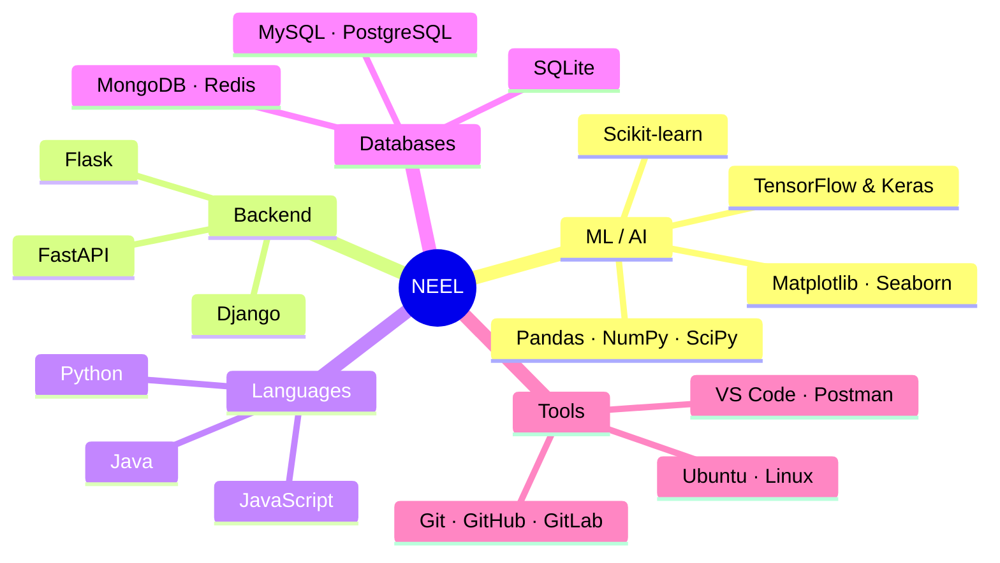

<!-- ================================================================ -->
<!--            NEEL SHAH — PRECISION TERMINAL PROFILE              -->
<!-- ================================================================ -->

<!-- ① HEADER — two crimson rails, clean dark name block -->


<div align="center">
<br/>
<br/>

# ◈ &nbsp; NEEL SHAH &nbsp; ◈

### `ML Engineering` &nbsp;·&nbsp; `B.Tech CS @ DDU` &nbsp;·&nbsp; `Vadodara, India 🇮🇳`

<br/>


&nbsp;&nbsp;


<br/>
<br/>

</div>


<br/>

<!-- ② TYPING SVG — Fira Code, exact lines untouched -->
<div align="center">
  
</div>

<br/>

<!-- ③ SPEC SHEET — identity as a hardware panel -->
<div align="center">

<table>
<tr>
<td align="left">

```
UNIT          Neel Shah
DESIGNATION   B.Tech Computer Science · Sem 4
INSTITUTE     Dharamsinh Desai University, Gujarat
LOCATION      Vadodara, India 🇮🇳
CORE FOCUS    ML Engineering · Neural Networks · Kaggle
PROJECTS      CleanHome · Credit Risk · Drift Detection
SPORT         Competitive Swimming · 🥉 City Level, Vadodara
FUEL          Chai + Curiosity
STATUS        [ ONLINE · BUILDING ]
```

</td>
</tr>
</table>

</div>

<!-- ④ IDENTITY BADGES -->
<div align="center">


</div>

<br/>

---

<!-- ⑤ ABOUT ME — log-style system output -->
<h2>💫 About Me</h2>

<table>
<tr><td><code>[BUILD]</code></td><td><b>CleanHome</b> — Django marketplace with service listings, bookings, user roles. Built it. Shipped it. Defended every design decision in a viva. 10/10 would stress again.</td></tr>
<tr><td><code>[RUNNING]</code></td><td><b>ML Pipelines</b> — Drift detection, ensemble methods, model versioning, REST API serving. Real systems, not notebooks.</td></tr>
<tr><td><code>[LEARNING]</code></td><td>How production ML actually works. DSA on the side because it never goes away.</td></tr>
<tr><td><code>[OPEN TO]</code></td><td>Backend systems, ML-powered apps, Django/FastAPI projects, anything with a reason to exist.</td></tr>
<tr><td><code>[ASK ME]</code></td><td>Django internals, ML pipeline design, making academic projects actually defensible.</td></tr>
<tr><td><code>[GOAL]</code></td><td>A portfolio where every project can answer the question <i>"why does this exist?"</i></td></tr>
</table>

---

<!-- ⑥ CURRENT FOCUS -->
<h2>🎯 Current Focus</h2>

<table>
<tr>
<td width="50%">

- 🧠 Neural Networks & Deep Learning
- 🏆 Kaggle Competitions

</td>
<td width="50%">

- ⚙️ Understanding Training Dynamics
- 🔬 Practical ML Experimentation

</td>
</tr>
</table>

---

<!-- ⑦ SKILL MAP — Mermaid mindmap, completely unique approach -->
<h2 align="center">🗺️ Skill Map</h2>



<br/>

<!-- ⑧ TECH ICONS — 2-column dashboard layout -->
<h2 align="center">🛠️ Tech Stack</h2>

<div align="center">

<table>
<tr>
<td align="center" width="50%">

<b>💬 Languages</b><br/><br/>


</td>
<td align="center" width="50%">

<b>🤖 ML / Data</b><br/><br/>

<br/><small>keras · pandas · numpy · scipy · seaborn</small>

</td>
</tr>
<tr>
<td align="center" width="50%">

<b>🌐 Frameworks</b><br/><br/>


</td>
<td align="center" width="50%">

<b>🗄️ Databases</b><br/><br/>


</td>
</tr>
</table>

<br/>

<div align="center">

<b>⚙️ Tools & DevEnv</b><br/><br/>


</div>

</div>

---

<!-- ⑨ TROPHIES -->
<h2 align="center">🏆 Trophies</h2>

<div align="center">
  
</div>

---

<!-- ⑩ GITHUB STATS — side by side -->
<h2 align="left">📊 GitHub Stats</h2>

<div align="center">

<table>
<tr>
<td>

</td>
<td>

</td>
</tr>
</table>


</div>

---

<!-- ⑪ CONTRIBUTION SNAKE -->
<h2 align="center">🌀 Contribution Grid</h2>

<div align="center">
<picture>
  <source media="(prefers-color-scheme: dark)" srcset="https://raw.githubusercontent.com/Neel58/Neel58/output/github-contribution-grid-snake-dark.svg" />
  <source media="(prefers-color-scheme: light)" srcset="https://raw.githubusercontent.com/Neel58/Neel58/output/github-contribution-grid-snake.svg" />
  
</picture>
</div>

---

<!-- ⑫ ACTIVITY GRAPH -->
<h2 align="center">🚀 Development Journey</h2>

<div align="center">
  
</div>

---

<!-- ⑬ BEYOND CODING — quote-panel style -->
<h2>🏊 Beyond Coding</h2>

> I'm also a competitive swimmer — **3rd place**, city-level competition, Vadodara.
>
> Swimming taught me what no tutorial ever could: that consistency without results is still progress, and that incremental improvement, compounded over time, is the only strategy that actually works.
>
> Same mindset. Different pool.

---

<!-- FOOTER — matching rails -->


<div align="center">
<br/>

### *"Consistency in the pool. Curiosity in the code."*

<br/>
</div>


